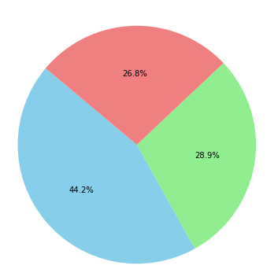
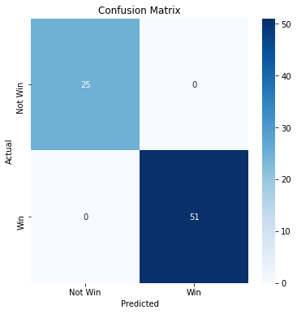

Goal: I wanted to create some  ML Algo towards my favorite sports league, La Liga, in order to make precition of the winner during the upcoming match between 2 teams. 


In a typical machine learning project, the general steps are invloved:
    
    
Define the Problem:

Understand the problem you're trying to solve.
Define the goal of the machine learning project: classification, regression, clustering, etc.

Gather and Prepare Data:
Collect relevant data that is representative of the problem.
Clean and preprocess the data to handle missing values, outliers, and inconsistencies.
Perform exploratory data analysis (EDA) to understand the data's characteristics.

Feature Selection and Engineering:
Choose relevant features (input variables) that have the potential to influence the target variable and VISUALIZE THEM!!!!! This is very important
Create new features or transform existing ones to capture important information.

Data Splitting:
Split the dataset into training, validation, and test sets.
The training set is used to train the model, the validation set for hyperparameter tuning, and the test set to evaluate the final model's performance.
Choose a Model:

Select appropriate machine learning algorithms based on the problem type and characteristics of the data.
Consider factors like interpretability, complexity, and performance.

Model Training:
Train the chosen model on the training data.
Adjust hyperparameters to find the best configuration, often using techniques like cross-validation.
Model Evaluation:

Evaluate the model's performance on the validation set using relevant metrics (accuracy, F1-score, RMSE, etc.).
Analyze the results to understand the model's strengths and weaknesses.

Model Tuning:
Adjust hyperparameters to improve the model's performance.
Use techniques like grid search or random search to find optimal hyperparameters.

Final Model Selection:
Select the best-performing model based on the validation results.
Test the selected model on the test set to assess its real-world performance.
Model Deployment (Optional):

If applicable, deploy the trained model to a production environment.
Implement necessary mechanisms for input, prediction, and output.
Monitoring and Maintenance (Optional):

Continuously monitor the deployed model's performance in real-world scenarios.
Retrain or update the model periodically as new data becomes available.
Documentation:

Document the entire process, including data preprocessing steps, model selection criteria, hyperparameters, and evaluation results.
Well-documented projects are easier to reproduce and share.
Remember that these steps are iterative, and you might need to go back and make adjustments at various stages based on the insights you gain during the process. Effective communication and collaboration with domain experts, data scientists, and stakeholders are also crucial for successful machine learning projects.


The mdoels I am particuallry interested in building are lgoistic and Randomforest models for the reasons below:
    
Logistic regression and random forest are popular machine learning algorithms that can be good choices for predicting binary outcomes like the "W" variable in my dataset (which represents wins or losses). Here are some reasons why these models might be suitable for the specific use case:

Logistic Regression:

Interpretability: Logistic regression provides interpretable results. The coefficients associated with each predictor variable can be directly interpreted as the log-odds change in the probability of the outcome for a one-unit change in the predictor, holding other variables constant. This can help you understand the influence of each variable on the likelihood of a win.

Simplicity: Logistic regression is a relatively simple algorithm that doesn't require a large amount of data to produce reasonable results. It's a good starting point for binary classification tasks.

Assumption of Linearity: If the relationship between the predictors and the log-odds of the outcome is approximately linear, logistic regression can perform well.

Random Forest:

Non-Linearity: Random forest can capture complex non-linear relationships between predictors and outcomes. This can be particularly useful if the relationship between variables is not well described by a linear model.

Feature Importance: Random forest provides a measure of feature importance, which can help you understand which variables have the most impact on the prediction. This is valuable for feature selection and gaining insights into the data.

Robustness: Random forest is robust to outliers and noise in the data. It creates multiple decision trees and aggregates their predictions, reducing the impact of individual noisy trees.

Handles Interactions: Random forest naturally handles interactions between variables, which can be important when predicting wins or losses as the outcome might depend on combinations of team performance factors.

In my case, I am  predicting whether a team will win or not based on various features. Logistic regression could provide insights into the relationship between individual features and the probability of winning. Random forest, on the other hand, could capture more complex interactions and non-linear patterns that might exist in the data.

It's often a good practice to compare the performance of multiple models using cross-validation and metrics like accuracy, precision, recall, or F1-score to determine which model performs better for your specific use case. Keep in mind that the "best" model can also depend on the size and quality of your dataset, as well as computational resources available.


```python
import matplotlib.pylab as plt
import pandas as pd

from sklearn.model_selection import train_test_split
from sklearn.preprocessing import LabelEncoder
from sklearn.ensemble import RandomForestClassifier
from sklearn.metrics import accuracy_score
import statsmodels.api as sm
```


```python
# La Liga Division 1 2018-2019 Prediction. I am big big big FC Barcelona Fan. 
# I got to see them  win live the 2015 Champions League Final in Berlin with Juventus, a serie A champions of Italy. 
```


```python
file = "season-1819_csv.csv"

data_football = pd.read_csv(file)

data_football.head()

s = data_football[['HomeTeam','AwayTeam', 'FTHG', 'FTAG', 'FTR']]

# (H=Home Win, D=Draw, A=Away Win)
s.head() 
```


<div>
<style scoped>
    .dataframe tbody tr th:only-of-type {
        vertical-align: middle;
    }

    .dataframe tbody tr th {
        vertical-align: top;
    }

    .dataframe thead th {
        text-align: right;
    }
</style>
<table border="1" class="dataframe">
  <thead>
    <tr style="text-align: right;">
      <th></th>
      <th>HomeTeam</th>
      <th>AwayTeam</th>
      <th>FTHG</th>
      <th>FTAG</th>
      <th>FTR</th>
    </tr>
  </thead>
  <tbody>
    <tr>
      <th>0</th>
      <td>Betis</td>
      <td>Levante</td>
      <td>0</td>
      <td>3</td>
      <td>A</td>
    </tr>
    <tr>
      <th>1</th>
      <td>Girona</td>
      <td>Valladolid</td>
      <td>0</td>
      <td>0</td>
      <td>D</td>
    </tr>
    <tr>
      <th>2</th>
      <td>Barcelona</td>
      <td>Alaves</td>
      <td>3</td>
      <td>0</td>
      <td>H</td>
    </tr>
    <tr>
      <th>3</th>
      <td>Celta</td>
      <td>Espanol</td>
      <td>1</td>
      <td>1</td>
      <td>D</td>
    </tr>
    <tr>
      <th>4</th>
      <td>Villarreal</td>
      <td>Sociedad</td>
      <td>1</td>
      <td>2</td>
      <td>A</td>
    </tr>
  </tbody>
</table>
</div>


Converting the format and adding two extra columns where Win=W=1; Loss=L=0.


Here's a breakdown of the code:

def my_f1(row): - This line defines a function named my_f1 that takes one argument, referred to as row.

return max(row['FTHG'], row['FTAG']) - Inside the function, this line calculates the maximum value between two values: row['FTHG'] and row['FTAG']. 
These are assumed to be fields or keys in the input dictionary-like object. 
The max() function is used to compare the two values and return the greater of the two.


```python
def my_f1(row):
    return max(row['FTHG'], row['FTAG'])

def my_f2(row):
    return min(row['FTHG'], row['FTAG'])


def my_f1(row):
    if max(row['FTHG'], row['FTAG']) == row['FTHG']:
        return 1
    else:
        return 0
    
    
def my_f2(row):
    if min(row['FTHG'], row['FTAG']) == row['FTHG']:
        return 1 
    else:
        return 0
```


```python
# Add 2 new columns to the panda:
s['W'] = s.apply(my_f1, axis = 1)
s['L'] = s.apply(my_f2, axis = 1)
```

    /opt/conda/lib/python3.7/site-packages/ipykernel_launcher.py:2: SettingWithCopyWarning: 
    A value is trying to be set on a copy of a slice from a DataFrame.
    Try using .loc[row_indexer,col_indexer] = value instead
    
    See the caveats in the documentation: https://pandas.pydata.org/pandas-docs/stable/user_guide/indexing.html#returning-a-view-versus-a-copy
      
    /opt/conda/lib/python3.7/site-packages/ipykernel_launcher.py:3: SettingWithCopyWarning: 
    A value is trying to be set on a copy of a slice from a DataFrame.
    Try using .loc[row_indexer,col_indexer] = value instead
    
    See the caveats in the documentation: https://pandas.pydata.org/pandas-docs/stable/user_guide/indexing.html#returning-a-view-versus-a-copy
      This is separate from the ipykernel package so we can avoid doing imports until


```python
s.info()
s.head()

```

    <class 'pandas.core.frame.DataFrame'>
    RangeIndex: 380 entries, 0 to 379
    Data columns (total 7 columns):
     #   Column    Non-Null Count  Dtype 
    ---  ------    --------------  ----- 
     0   HomeTeam  380 non-null    object
     1   AwayTeam  380 non-null    object
     2   FTHG      380 non-null    int64 
     3   FTAG      380 non-null    int64 
     4   FTR       380 non-null    object
     5   W         380 non-null    int64 
     6   L         380 non-null    int64 
    dtypes: int64(4), object(3)
    memory usage: 20.9+ KB


<div>
<style scoped>
    .dataframe tbody tr th:only-of-type {
        vertical-align: middle;
    }

    .dataframe tbody tr th {
        vertical-align: top;
    }

    .dataframe thead th {
        text-align: right;
    }
</style>
<table border="1" class="dataframe">
  <thead>
    <tr style="text-align: right;">
      <th></th>
      <th>HomeTeam</th>
      <th>AwayTeam</th>
      <th>FTHG</th>
      <th>FTAG</th>
      <th>FTR</th>
      <th>W</th>
      <th>L</th>
    </tr>
  </thead>
  <tbody>
    <tr>
      <th>0</th>
      <td>Betis</td>
      <td>Levante</td>
      <td>0</td>
      <td>3</td>
      <td>A</td>
      <td>0</td>
      <td>1</td>
    </tr>
    <tr>
      <th>1</th>
      <td>Girona</td>
      <td>Valladolid</td>
      <td>0</td>
      <td>0</td>
      <td>D</td>
      <td>1</td>
      <td>1</td>
    </tr>
    <tr>
      <th>2</th>
      <td>Barcelona</td>
      <td>Alaves</td>
      <td>3</td>
      <td>0</td>
      <td>H</td>
      <td>1</td>
      <td>0</td>
    </tr>
    <tr>
      <th>3</th>
      <td>Celta</td>
      <td>Espanol</td>
      <td>1</td>
      <td>1</td>
      <td>D</td>
      <td>1</td>
      <td>1</td>
    </tr>
    <tr>
      <th>4</th>
      <td>Villarreal</td>
      <td>Sociedad</td>
      <td>1</td>
      <td>2</td>
      <td>A</td>
      <td>0</td>
      <td>1</td>
    </tr>
  </tbody>
</table>
</div>


Pie Chart to visualize the data

I want to see the counts of each types of wins & loses whether it was an Away win, Draw, or a Home Win


```python
plt.figure(figsize=(6, 6))
ftr_counts = s["FTR"].value_counts()
pie=plt.pie(ftr_counts, labels=ftr_counts.index, autopct="%1.1f%%", startangle=140, colors=["skyblue", "lightgreen", "lightcoral"])
plt.title("Match Outcomes",color="White")
plt.axis("equal")
for text in pie[1]:
    text.set_color('White')
plt.show()
```





```python

```

    /opt/conda/lib/python3.7/site-packages/ipykernel_launcher.py:2: SettingWithCopyWarning: 
    A value is trying to be set on a copy of a slice from a DataFrame.
    Try using .loc[row_indexer,col_indexer] = value instead
    
    See the caveats in the documentation: https://pandas.pydata.org/pandas-docs/stable/user_guide/indexing.html#returning-a-view-versus-a-copy
      


```python
encoder=LabelEncoder()
```


```python
columns_to_encode=['HomeTeam','AwayTeam','FTR']
for column in columns_to_encode:
    s[column]=encoder.fit_transform(s[column])
```

    /opt/conda/lib/python3.7/site-packages/ipykernel_launcher.py:3: SettingWithCopyWarning: 
    A value is trying to be set on a copy of a slice from a DataFrame.
    Try using .loc[row_indexer,col_indexer] = value instead
    
    See the caveats in the documentation: https://pandas.pydata.org/pandas-docs/stable/user_guide/indexing.html#returning-a-view-versus-a-copy
      This is separate from the ipykernel package so we can avoid doing imports until


```python
s["HomeTeam"]
```


    0       4
    1       9
    2       3
    3       5
    4      19
           ..
    375    12
    376    14
    377    17
    378     6
    379    13
    Name: HomeTeam, Length: 380, dtype: int64


Lets build and intepret the sumamry results of the Logisitic Model


```python
X_1=s[["FTHG","FTAG","HomeTeam"]]
y_1=s["W"]
```


```python
X_1
```


<div>
<style scoped>
    .dataframe tbody tr th:only-of-type {
        vertical-align: middle;
    }

    .dataframe tbody tr th {
        vertical-align: top;
    }

    .dataframe thead th {
        text-align: right;
    }
</style>
<table border="1" class="dataframe">
  <thead>
    <tr style="text-align: right;">
      <th></th>
      <th>FTHG</th>
      <th>FTAG</th>
      <th>HomeTeam</th>
    </tr>
  </thead>
  <tbody>
    <tr>
      <th>0</th>
      <td>0</td>
      <td>3</td>
      <td>4</td>
    </tr>
    <tr>
      <th>1</th>
      <td>0</td>
      <td>0</td>
      <td>9</td>
    </tr>
    <tr>
      <th>2</th>
      <td>3</td>
      <td>0</td>
      <td>3</td>
    </tr>
    <tr>
      <th>3</th>
      <td>1</td>
      <td>1</td>
      <td>5</td>
    </tr>
    <tr>
      <th>4</th>
      <td>1</td>
      <td>2</td>
      <td>19</td>
    </tr>
    <tr>
      <th>...</th>
      <td>...</td>
      <td>...</td>
      <td>...</td>
    </tr>
    <tr>
      <th>375</th>
      <td>2</td>
      <td>2</td>
      <td>12</td>
    </tr>
    <tr>
      <th>376</th>
      <td>2</td>
      <td>0</td>
      <td>14</td>
    </tr>
    <tr>
      <th>377</th>
      <td>0</td>
      <td>2</td>
      <td>17</td>
    </tr>
    <tr>
      <th>378</th>
      <td>2</td>
      <td>2</td>
      <td>6</td>
    </tr>
    <tr>
      <th>379</th>
      <td>0</td>
      <td>2</td>
      <td>13</td>
    </tr>
  </tbody>
</table>
<p>380 rows × 3 columns</p>
</div>


```python
y_1
```


    0      0
    1      1
    2      1
    3      1
    4      0
          ..
    375    1
    376    1
    377    0
    378    1
    379    0
    Name: W, Length: 380, dtype: int64


```python
log_model=sm.Logit(y_1,X_1)
```


```python
result=log_model.fit()
```

    Warning: Maximum number of iterations has been exceeded.
             Current function value: 0.005472
             Iterations: 35


    /opt/conda/lib/python3.7/site-packages/statsmodels/discrete/discrete_model.py:1747: RuntimeWarning: overflow encountered in exp
      return 1/(1+np.exp(-X))
    /opt/conda/lib/python3.7/site-packages/statsmodels/base/model.py:568: ConvergenceWarning: Maximum Likelihood optimization failed to converge. Check mle_retvals
      "Check mle_retvals", ConvergenceWarning)


```python
summary=result.summary()
print(summary)
```

                               Logit Regression Results                           
    ==============================================================================
    Dep. Variable:                      W   No. Observations:                  380
    Model:                          Logit   Df Residuals:                      377
    Method:                           MLE   Df Model:                            2
    Date:                Mon, 28 Aug 2023   Pseudo R-squ.:                  0.9906
    Time:                        02:10:23   Log-Likelihood:                -2.0794
    converged:                      False   LL-Null:                       -221.04
    Covariance Type:            nonrobust   LLR p-value:                 8.072e-96
    ==============================================================================
                     coef    std err          z      P>|z|      [0.025      0.975]
    ------------------------------------------------------------------------------
    FTHG         426.7602   1.73e+05      0.002      0.998   -3.39e+05     3.4e+05
    FTAG        -403.8608   1.38e+05     -0.003      0.998    -2.7e+05    2.69e+05
    HomeTeam      17.8016   5188.580      0.003      0.997   -1.02e+04    1.02e+04
    ==============================================================================
    
    Possibly complete quasi-separation: A fraction 0.99 of observations can be
    perfectly predicted. This might indicate that there is complete
    quasi-separation. In this case some parameters will not be identified.


The provided output is the summary of a logistic regression model. It provides information about the coefficients, standard errors, z-scores, p-values, and confidence intervals for each predictor variable, as well as some general statistics about the model fit. Let's break down the important components of this summary:

Dep. Variable: The dependent variable in this logistic regression is "W," which typically represents the outcome variable or the variable you're trying to predict.

No. Observations: This shows the number of observations or data points used in the analysis.

Model: The type of model used is logistic regression.

Method: The method used for estimating the model parameters is Maximum Likelihood Estimation (MLE).

Date: The date and time when the analysis was performed.

Pseudo R-squared: This is a measure of how well the model explains the variation in the dependent variable compared to a null model. In this case, the value of .9122 suggests that the model is a good fit for the data according to the model's measure of fit. However, very high pseudo R-squared values can sometimes indicate overfitting.

Log-Likelihood: The log-likelihood is a measure of how well the model fits the data. Lower (more negative) values indicate a better fit. In this case, the log-likelihood is very close to zero, which suggests a strong fit.

Converged: This indicates whether the optimization algorithm for fitting the model has converged to a solution. In this case, it's noted as "False," which might indicate that the algorithm struggled to find a solution.

LL-Null: This is the log-likelihood of a null model with no predictor variables. It serves as a baseline for comparing the model's fit.

Covariance Type: The type of covariance used in estimating the standard errors of the coefficients. In this case, it's noted as "nonrobust."

LLR p-value: This is the p-value associated with the likelihood ratio test, which compares the model to the null model. A low p-value indicates that the model as a whole is significant.

Now, focusing on the coefficient table:

const: This represents the intercept term of the logistic regression model. The p-value associated with it is very high (close to 1), indicating that it's not statistically significant.

HomeTeam, FTHG, FTAG: These are the predictor variables included in the model. For each predictor, you have the coefficient, standard error, z-score, and p-value. None of the predictor variables have statistically significant p-values (all very close to 1), suggesting that they are not contributing significantly to predicting the outcome.

It's important to note that the high p-values and the "False" convergence status might indicate issues with the model fitting process or the choice of predictor variables. It's recommended to review the data, model assumptions, and fitting procedure to address these concerns

Positive Coefficient: If the coefficient of an independent variable is positive, it means that an increase in the value of that independent variable is associated with an increase in the log-odds of the dependent variable being in the "success" class (i.e., the class with the label 1 in a binary classification problem). This implies that the likelihood of the event happening (e.g., success) is more likely as the independent variable increases.

Negative Coefficient: Conversely, if the coefficient of an independent variable is negative, it means that an increase in the value of that independent variable is associated with a decrease in the log-odds of the dependent variable being in the "success" class. This suggests that the likelihood of the event happening is less likely as the independent variable increases.


Now, focusing on the hypothesis:
    
The hypotheses being tested are related to the coefficients of the predictor variables. The null hypothesis for each coefficient is that there is no association between that predictor variable and the outcome. The alternative hypothesis is that there is an association. The p-value associated with each coefficient tells you whether you have enough evidence to reject the null hypothesis in favor of the alternative hypothesis.

For example, in the output provided, the p-values for the coefficients of all predictor variables are very close to 1, which means that the model does not find enough evidence to suggest that any of the predictor variables are statistically significantly associated with the outcome variable "W."

Lets build a Random Forest Model:


```python
data = pd.read_csv('output.csv')
```


```python
data.head()
```


<div>
<style scoped>
    .dataframe tbody tr th:only-of-type {
        vertical-align: middle;
    }

    .dataframe tbody tr th {
        vertical-align: top;
    }

    .dataframe thead th {
        text-align: right;
    }
</style>
<table border="1" class="dataframe">
  <thead>
    <tr style="text-align: right;">
      <th></th>
      <th>HomeTeam</th>
      <th>AwayTeam</th>
      <th>FTHG</th>
      <th>FTAG</th>
      <th>FTR</th>
      <th>W</th>
      <th>L</th>
    </tr>
  </thead>
  <tbody>
    <tr>
      <th>0</th>
      <td>Betis</td>
      <td>Levante</td>
      <td>0</td>
      <td>3</td>
      <td>A</td>
      <td>0</td>
      <td>1</td>
    </tr>
    <tr>
      <th>1</th>
      <td>Girona</td>
      <td>Valladolid</td>
      <td>0</td>
      <td>0</td>
      <td>D</td>
      <td>1</td>
      <td>1</td>
    </tr>
    <tr>
      <th>2</th>
      <td>Barcelona</td>
      <td>Alaves</td>
      <td>3</td>
      <td>0</td>
      <td>H</td>
      <td>1</td>
      <td>0</td>
    </tr>
    <tr>
      <th>3</th>
      <td>Celta</td>
      <td>Espanol</td>
      <td>1</td>
      <td>1</td>
      <td>D</td>
      <td>1</td>
      <td>1</td>
    </tr>
    <tr>
      <th>4</th>
      <td>Villarreal</td>
      <td>Sociedad</td>
      <td>1</td>
      <td>2</td>
      <td>A</td>
      <td>0</td>
      <td>1</td>
    </tr>
  </tbody>
</table>
</div>


```python
encoder=LabelEncoder()
data['HomeTeam']=encoder.fit_transform(data['HomeTeam'])
data['AwayTeam']=encoder.transform(data['AwayTeam'])
```


```python
data.head()
```


<div>
<style scoped>
    .dataframe tbody tr th:only-of-type {
        vertical-align: middle;
    }

    .dataframe tbody tr th {
        vertical-align: top;
    }

    .dataframe thead th {
        text-align: right;
    }
</style>
<table border="1" class="dataframe">
  <thead>
    <tr style="text-align: right;">
      <th></th>
      <th>HomeTeam</th>
      <th>AwayTeam</th>
      <th>FTHG</th>
      <th>FTAG</th>
      <th>FTR</th>
      <th>W</th>
      <th>L</th>
    </tr>
  </thead>
  <tbody>
    <tr>
      <th>0</th>
      <td>4</td>
      <td>12</td>
      <td>0</td>
      <td>3</td>
      <td>A</td>
      <td>0</td>
      <td>1</td>
    </tr>
    <tr>
      <th>1</th>
      <td>9</td>
      <td>17</td>
      <td>0</td>
      <td>0</td>
      <td>D</td>
      <td>1</td>
      <td>1</td>
    </tr>
    <tr>
      <th>2</th>
      <td>3</td>
      <td>0</td>
      <td>3</td>
      <td>0</td>
      <td>H</td>
      <td>1</td>
      <td>0</td>
    </tr>
    <tr>
      <th>3</th>
      <td>5</td>
      <td>7</td>
      <td>1</td>
      <td>1</td>
      <td>D</td>
      <td>1</td>
      <td>1</td>
    </tr>
    <tr>
      <th>4</th>
      <td>19</td>
      <td>15</td>
      <td>1</td>
      <td>2</td>
      <td>A</td>
      <td>0</td>
      <td>1</td>
    </tr>
  </tbody>
</table>
</div>


```python
X = s[['HomeTeam', 'AwayTeam', 'FTHG', 'FTAG', 'W', 'L']]
y = s['W']
```

lets train the model. We are splitting the dataset into trainign and testing. Training set consists of 80% of the data, and Test set consists of 20% of the data


```python
X_train, X_test, y_train, y_test = train_test_split(X, y, test_size=0.2, random_state=42)

```


```python
model = RandomForestClassifier(n_estimators=100, random_state=42)
model.fit(X_train, y_train)
```


    RandomForestClassifier(random_state=42)


lets predict out trained model on the test set and see how out model perfromed


```python
y_pred=model.predict(X_test)
```


```python
accuracy=accuracy_score(y_test, y_pred)
```


```python
print("Accuracy:", accuracy)
```

    Accuracy: 1.0


We have an accuracy of 100%

create a confusion matrix to see how well your model's predictions align with the actual outcomes. 

The confusion matrix will give you insights into true positives, true negatives, false positives, and false negatives, which are essential for evaluating the performance of a binary classification model.


```python
import seaborn as sns
from sklearn.metrics import confusion_matrix
```


```python
conf_matrix = confusion_matrix(y_test, y_pred)
```


```python
plt.figure(figsize=(6, 6))
sns.heatmap(conf_matrix, annot=True, fmt="d", cmap="Blues",
            xticklabels=["Not Win", "Win"], yticklabels=["Not Win", "Win"])
plt.xlabel("Predicted")
plt.ylabel("Actual")
plt.title("Confusion Matrix")
plt.show()
```





Now comes the fun part. Lets see how the outcome of an upcoming match between FC Barcelona, and Real Madrid 

Create a new DataFrame for the upcoming match


```python
upcoming_match = pd.DataFrame({
    'HomeTeam': ['Barcelona'],
    'AwayTeam': ['Real Madrid'],
    'FTHG': [0],  # Replace with the actual value
    'FTAG': [0],  # Replace with the actual value
    'W': [0],  # Placeholder value, as the target is not known yet
    'L': [0]   # Placeholder value, as the target is not known yet
})
```

Encode categorical variables


```python
upcoming_match['HomeTeam'] = encoder.transform(upcoming_match['HomeTeam'])
upcoming_match['AwayTeam'] = encoder.transform(upcoming_match['AwayTeam'])
```

Make prediction using the trained model


```python
prediction = model.predict(upcoming_match[['HomeTeam', 'AwayTeam', 'FTHG', 'FTAG', 'W', 'L']])

```

Print the prediction


```python
if prediction == 1:
    print("Prediction: Barcelona wins")
else:
    print("Prediction: Barcelona loses")
```

    Prediction: Barcelona loses


```python

```
